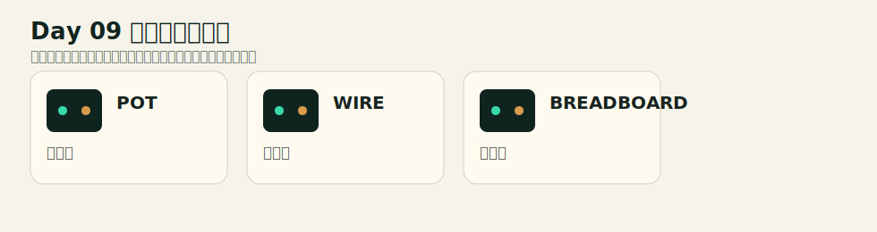
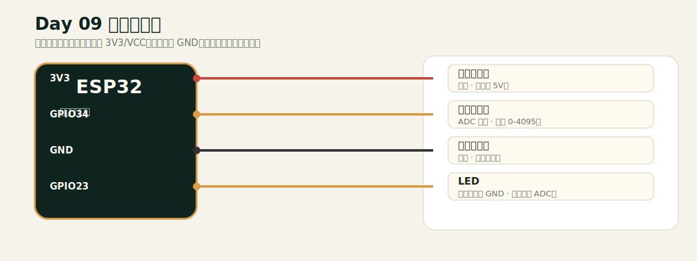

# Day 09 接线文档

## 元器件实物示意

## 连接接线图

## 接线表

| 模块/引脚 | 连接到 ESP32 | 类型 | 说明 |
|---|---|---|---|
| 电位器左脚 | 3V3 | 供电 | 不要接 5V。 |
| 电位器中脚 | GPIO34 | ADC 输入 | 读取 0-4095。 |
| 电位器右脚 | GND | 共地 | 形成分压。 |
| LED | GPIO23 | 串联电阻到 GND | 亮度跟随 ADC。 |

## 安全检查

- 改线前先拔掉 USB 或断开外部电源。
- ESP32 GPIO 通常是 3.3V 逻辑，不要把 5V 信号直接送入 GPIO。
- 每个 LED 必须串联 220Ω 或 330Ω 限流电阻。
- 所有模块必须和 ESP32 共地。
- 如果现象异常，先退回只接一个模块的最小电路。
