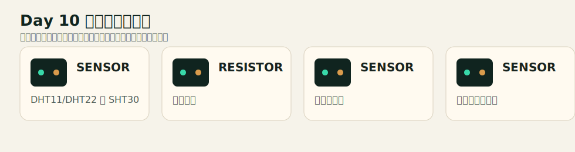
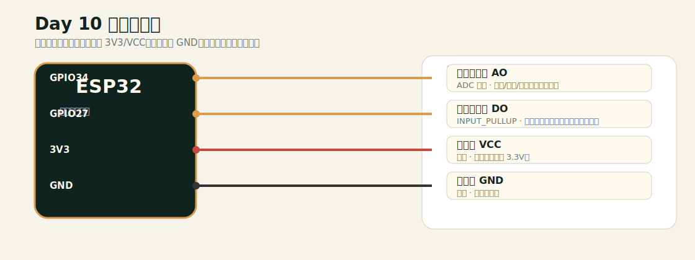

# Day 10 接线文档

## 元器件实物示意

## 连接接线图

## 接线表

| 模块/引脚 | 连接到 ESP32 | 类型 | 说明 |
|---|---|---|---|
| 模拟传感器 AO | GPIO34 | ADC 输入 | 光敏/声音/电位器模块均可。 |
| 数字传感器 DO | GPIO27 | INPUT_PULLUP | 阈值输出，按模块可能高低相反。 |
| 传感器 VCC | 3V3 | 供电 | 确认模块支持 3.3V。 |
| 传感器 GND | GND | 共地 | 必须共地。 |

## 安全检查

- 改线前先拔掉 USB 或断开外部电源。
- ESP32 GPIO 通常是 3.3V 逻辑，不要把 5V 信号直接送入 GPIO。
- 每个 LED 必须串联 220Ω 或 330Ω 限流电阻。
- 所有模块必须和 ESP32 共地。
- 如果现象异常，先退回只接一个模块的最小电路。
