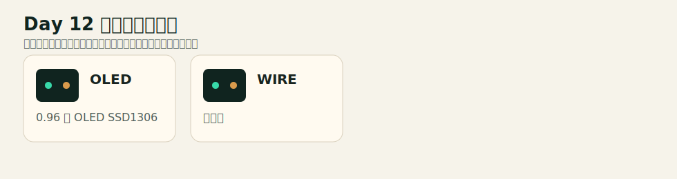
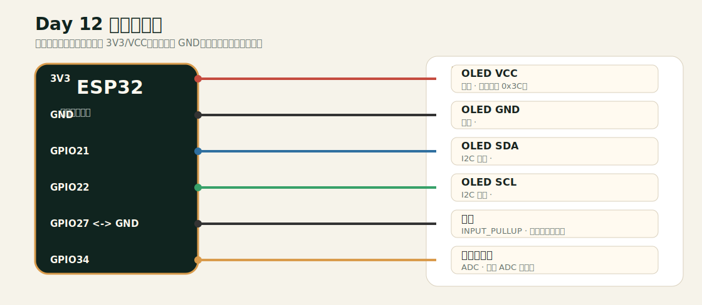

# Day 12 接线文档

## 元器件实物示意

## 连接接线图

## 接线表

| 模块/引脚 | 连接到 ESP32 | 类型 | 说明 |
|---|---|---|---|
| OLED VCC | 3V3 | 供电 | 默认地址 0x3C。 |
| OLED GND | GND | 共地 |  |
| OLED SDA | GPIO21 | I2C 数据 |  |
| OLED SCL | GPIO22 | I2C 时钟 |  |
| 按键 | GPIO27 <-> GND | INPUT_PULLUP | 显示按键状态。 |
| 电位器中脚 | GPIO34 | ADC | 显示 ADC 数值。 |

## 安全检查

- 改线前先拔掉 USB 或断开外部电源。
- ESP32 GPIO 通常是 3.3V 逻辑，不要把 5V 信号直接送入 GPIO。
- 每个 LED 必须串联 220Ω 或 330Ω 限流电阻。
- 所有模块必须和 ESP32 共地。
- 如果现象异常，先退回只接一个模块的最小电路。
